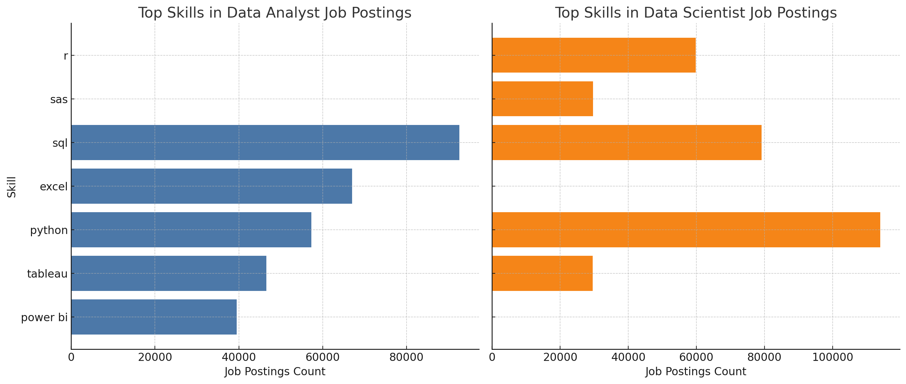

# 🌍 SQL Job Market Analysis Project

A self-guided SQL project focused on exploring and analyzing a global dataset of job postings. This project demonstrates practical SQL skills through structured queries to answer key questions about hiring trends, roles, salaries, locations and the optimization of demand and salary expectations.

#### 🔍SQL queries? Check them out here: [project_sql folder](/project_sql/)

---

## 🧠  Project Objective

The questions I wanted to answer through the exploration of Job Postings data using SQL queries were:

1. What are the top-paying Data Analyst and Data Scientist jobs?
2. What skills are required for these top-paying roles?
3. What skills are most in demand for these roles?
4. Which skills are associated with higher salaries?
5. What are the most optimal skills to learn?

---

## 🗃️ Dataset Overview

The database includes 4 tables:
 "job_postings_fact", "company_dim", "skills_dim" and "skills_job_dim"
 
 The "job_postings_fact" includes the following key fields:
- 'job_id'
- 'company_id'
- 'job_title_short'
- 'job_title'
- 'job_location'
- 'job_via'
- 'job_schedule_type'
- 'job_work_from_home'
- 'search_location'
- 'job_posted_date'
- 'job_no_degree_mention'
- 'job_health_insurance'
- 'job_country'
- 'salary_rate'
- 'salary_year_avg'
- 'salary_hour_avg'

The "company_dim" includes the following key fields:
- 'company_id'
- 'name'
- 'link'
- 'link_google'
- 'thumbnail'

The "skills_dim" includes the following key fields:
- 'skill_id'
- 'skills'
- 'type'

The "skills_job_dim" includes the following key fields:
- 'job_id'
- 'skill_id'


> *Note: Dataset was pre-cleaned and loaded into a relational PostgreSQL database for query-based analysis.*

---

## 🛠️ Tools & Technologies

For my deep dive into the Data Analysis and Data Scientist job market, I used several powerful tools, such as:
- **SQL** - The backbone of my analysis allowing me to query the database and discover critical insights.
- **PostgreSQL** - The chosen database management system, ideal for handling the job posting data.
- **Visual Studio Code (VS Code)** – for writing, executing queries and organizing query files
- **Git & GitHub**- Essential for version control and sharing my SQL scripts and analysis, ensuring collaboration and project tracking.

---

## 📊 Analysis
Each query for the project was aimed to investigate specific aspects of the Data Analyst and Data Scientists job market. Here's how I approached each question:

### 1. Top-paying Data Analyst and Data Scientist jobs:
To identify the highest paying roles, I filtered data analyst and data scientist positions, exluding job posts without a specified salary, and fitlering the locations to focus on roles based in Mexico or Remote roles. This query highlights the high paying job opportunities in the field:

```sql
WITH ranked_jobs AS (
    SELECT
        job_id,
        job_title,
        job_location AS location,
        job_schedule_type AS schedule_type,
        salary_year_avg AS salary,
        job_posted_date,
        company_id,
        ROW_NUMBER() OVER (
            PARTITION BY job_title
            ORDER BY salary_year_avg DESC
        ) AS rank
    FROM
        job_postings_fact
    WHERE
        job_title IN ('Data Analyst', 'Data Scientist')
        AND job_location IN ('Anywhere', 'Mexico', 'Mexico City', 'Remote')
        AND salary_year_avg IS NOT NULL
)
SELECT
    rank,
    job_id,
    job_title,
    location,
    company_dim.name AS company_name,
    schedule_type,
    salary,
    job_posted_date
FROM
    ranked_jobs
LEFT JOIN
    company_dim ON ranked_jobs.company_id = company_dim.company_id
WHERE
    rank <= 10;
```
Here's a breakdown of the top Data Analyst and Data Scientist jobs in 2023:

- **Pay grade comparison:** The top 10 Data Scientist roles average $386K, while Data Analyst roles average $246K, highlighting a clear compensation gap at the highest-paying tier.

- **Location:** All positions are listed as "Anywhere" and "Full-time", reinforcing the trend of remote flexibility in top-paying data roles.

- **Employers:** High-paying roles come from important and well-known companies like Meta, Reddit, Walmart, AT&T, and Pinterest, indicating strong competition for senior data talent.

### 2. Skills  required for these top-paying roles

Taking the previous query as a foundation, I proceeded to add a column with the list of the corresponding skills required by the job post. In this step, we have to join the skills_job_dim table to pair the skills required for each job, and the skills_dim table to get the details corresponding to the different skills listed in each of the job postings.

The following query produces the desired result to answer the question:


```sql
    WITH jobs_with_skills AS (
        SELECT DISTINCT
            jpf.job_id,
            jpf.job_title,
            jpf.salary_year_avg AS salary,
            jpf.company_id
        FROM
            job_postings_fact AS jpf
        INNER JOIN
            skills_job_dim AS skjd ON skjd.job_id = jpf.job_id
        WHERE
            jpf.job_title IN ('Data Analyst', 'Data Scientist')
            AND jpf.job_location IN ('Anywhere', 'Mexico', 'Mexico City', 'Remote')
            AND jpf.salary_year_avg IS NOT NULL
    ),
    ranked_jobs AS (
        SELECT *,
            ROW_NUMBER() OVER (
                PARTITION BY job_title
                ORDER BY salary DESC
            ) AS rank
        FROM jobs_with_skills
    )
    SELECT
        r.rank,
        r.job_id,
        r.job_title,
        c.name AS company_name,
        r.salary,
        STRING_AGG(skd.skills, ', ') AS skill_list 
    FROM
        ranked_jobs AS r
    LEFT JOIN
        company_dim AS c ON r.company_id = c.company_id
    INNER JOIN
        skills_job_dim AS skjd ON skjd.job_id = r.job_id
    INNER JOIN
        skills_dim AS skd ON skjd.skill_id = skd.skill_id
    WHERE
        r.rank <= 10
    GROUP BY
        r.rank, r.job_id, r.job_title, c.name, r.salary;

```
Here’s a breakdown of the top skills associated with the highest-paying Data Analyst and Data Scientist job postings:
1. **Python and SQL Dominate Across Roles:** Both Data Analysts and Data Scientists always require Python and SQL, validating them as fundamental skills in high-paying data roles.
2. **Role-Specific Specializations:**
    
    - Data Analysts often list tools like Excel, Tableau, Power BI, Looker, and Pandas, reflecting a focus on data manipulation, reporting, and BI tools.

    - Data Scientists prefer Spark, Hadoop, AWS, Java, and machine learning libraries (e.g., scikit-learn, TensorFlow) more frequently, reflecting more advanced modeling and engineering requirements.
3. **Deep Technical Stacks in Higher Salaries:**
    Higher-paying listings often include a larger and more diverse skill set, such as cloud platforms, programming languages beyond Python, and data infrastructure tools, indicating employers are willing to pay more for multi-skilled professionals.

### 3. Skills demand across the database
To find out which skills are the most demanded across the entirety of the job postings data base I have to group the job postings count by the name of each individual skill, then order the results with a window function that partitions the ranking for both Data Analyst and Data Scientists roles.

The follwing query gives the desired results:

```sql
WITH ranked_skills as(
    SELECT
        jp.job_title_short as job_title,
        skd.skills as skill_name,
        COUNT(jp.job_id) AS job_count,
        RANK() 
            OVER (PARTITION BY jp.job_title_short 
            ORDER BY COUNT(jp.job_id) DESC) AS skill_rank
    FROM
        job_postings_fact AS jp
    INNER JOIN
        skills_job_dim AS skjd ON jp.job_id = skjd.job_id
    INNER JOIN
        skills_dim AS skd ON skjd.skill_id = skd.skill_id
    WHERE
        jp.job_title_short IN ('Data Analyst', 'Data Scientist')
    GROUP BY
        jp.job_title_short,
        skd.skills
    ORDER BY
        jp.job_title_short, job_count DESC)
        
    SELECT *
    FROM
        ranked_skills
    WHERE
        skill_rank <= 5;
```
### Query Results


*Graphic 1 - Visualization of the top 5 skills per role by job postings count*


**Python and SQL Lead Across Both Roles:**

- SQL is the most in-demand skill for Data Analysts (92.6K postings), while Python is the top skill for Data Scientists (114K postings).

- Both skills appear in the top 3 for each role, emphasizing their foundational importance in data careers.

**Tooling Reflects Role Focus:**

- Data Analysts commonly require Excel, Power BI, and Tableau, indicating a focus on reporting, dashboarding, and business decision support.

- Data Scientists emphasize R and SAS, reflecting statistical modeling and advanced analytics capabilities.

### 4. Top 5 skills by average salary

I now want to identify which are the highest paid skills by average salary for both roles. 

To achieve this, I will use the previous query as a foundation, replacing the job posting count with an aggregation of the average salary per skill. The results will be ordered by salary, ranked accordingly, and filtered to extract only the top five skills for each role.

Heres the query that results in the top 5 skills per role by average salary:

```sql
WITH job_count_skill AS (
    SELECT 
        jp.job_title_short AS job_title,
        skd.skills AS skill_name,
        COUNT(*) AS job_count,
        ROUND(AVG(jp.salary_year_avg)) AS avg_salary
    FROM
        job_postings_fact AS jp
    INNER JOIN
        skills_job_dim AS skjd ON jp.job_id = skjd.job_id
    INNER JOIN
        skills_dim AS skd ON skjd.skill_id = skd.skill_id
    WHERE
        jp.job_title_short IN ('Data Analyst', 'Data Scientist')
        AND jp.salary_year_avg IS NOT NULL
    GROUP BY
        jp.job_title_short,
        skd.skills

), 
ranked_skills AS (
    SELECT
        RANK() OVER (PARTITION BY job_title ORDER BY avg_salary DESC) AS skill_rank,
        *
    FROM
        job_count_skill
    WHERE
        job_count > 100 -- Ensuring  a bit of robustness to avoid skewedness in skills demanded in too few jobpostings with high salary
)
SELECT
    *
FROM
    ranked_skills
WHERE
    ranked_skills.skill_rank <= 5
;
```
The results of this query are:

### Data Analyst: Highest Paying Skills

| Rank | Skill       | Avg Salary | Job Count |
|------|-------------|------------|-----------|
| 1    | Spark       | $113,002   | 187       |
| 2    | Databricks  | $112,881   | 102       |
| 3    | Snowflake   | $111,578   | 241       |
| 4    | Hadoop      | $110,888   | 140       |
| 5    | NoSQL       | $108,331   | 108       |

These are all big data and cloud-oriented tools, indicating that data analysts proficient in distributed processing and modern data platforms command higher salaries.

### Data Scientist: Highest Paying Skills

| Rank | Skill     | Avg Salary | Job Count |
|------|-----------|------------|-----------|
| 1    | Airflow   | $155,878   | 144       |
| 2    | BigQuery  | $149,292   | 135       |
| 3    | Looker    | $147,538   | 186       |
| 4    | Go        | $147,466   | 316       |
| 5    | PyTorch   | $145,989   | 564       |

These skills are closely tied to advanced data infrastructure and machine learning tools. For Data Scientists, technologies like Airflow, BigQuery, and PyTorch lead to higher salaries, reflecting demand for expertise in data pipelines and deep learning. 

Notably, the most lucrative skills tend to be less common in job postings, suggesting they are more specialized and therefore demand premium compensation.

### 5. Top 10 skills by Salary and Demand optimization

Finally, to gain the most valuable insight for making an informed decision about where to focus my career development, I aimed to optimize the skill ranking by combining two key factors:

- The demand for each skill, to ensure job security.
- The average salary associated with each skill, to maximize the economic return on the skills acquired

This query combines the two previous ones by merging the job count and the average salary aggregations, the job count is normalized by a logarithmic scale to allow niche skills with high pay but moderate demand to remain competitive, this avoids skewing the data with job posts with very high demand.

The final query is the following:

```sql
WITH skills_demand AS (
    SELECT
        skd.skill_id,
        skd.skills,
        jp.job_title_short,
        COUNT(skjd.job_id) AS demand_count
    FROM
        job_postings_fact AS jp
    INNER JOIN
        skills_job_dim AS skjd ON jp.job_id = skjd.job_id
    INNER JOIN
        skills_dim AS skd ON skjd.skill_id = skd.skill_id
    WHERE
        jp.job_title_short IN ('Data Analyst', 'Data Scientist')
        AND jp.salary_year_avg IS NOT NULL
        AND jp.job_work_from_home = TRUE
    GROUP BY
        skd.skill_id, skd.skills, jp.job_title_short
    ),
    average_salary AS (
    SELECT
        skd.skill_id,
        skd.skills,
        jp.job_title_short,
        ROUND(AVG(jp.salary_year_avg), 0) AS avg_salary
    FROM
        job_postings_fact AS jp
    INNER JOIN
        skills_job_dim AS skjd ON jp.job_id = skjd.job_id
    INNER JOIN
        skills_dim AS skd ON skjd.skill_id = skd.skill_id
    WHERE
        jp.job_title_short IN ('Data Analyst', 'Data Scientist')
        AND jp.salary_year_avg IS NOT NULL
        AND jp.job_work_from_home = TRUE
    GROUP BY
        skd.skill_id, skd.skills, jp.job_title_short
    ),
    top_paying_skills_results AS (
    SELECT
        sd.skill_id,
        sd.skills AS skill_name,
        sd.demand_count,
        avgs.avg_salary,
        sd.job_title_short
    FROM
        skills_demand AS sd
    INNER JOIN
        average_salary AS avgs 
        ON sd.skill_id = avgs.skill_id AND sd.job_title_short = avgs.job_title_short
    ),
    scored_skills AS (
    SELECT 
        job_title_short,
        skill_name,
        demand_count,
        avg_salary,
        ROUND((avg_salary * LOG(GREATEST(demand_count, 1)))::numeric, 2) AS demand_weighted_score
    FROM 
        top_paying_skills_results
    )
    SELECT *
    FROM (
        SELECT 
            ROW_NUMBER() OVER (PARTITION BY job_title_short ORDER BY demand_weighted_score DESC) AS rank,
            *
        FROM 
            scored_skills
    ) ranked
    WHERE rank <= 10
    ORDER BY job_title_short, demand_weighted_score DESC
    ;


```
### Results are as follow:
### Data Analyst – Top 10 Skills by Salary and Demand

| Rank | Skill       | Demand Count | Avg Salary | Demand-Weighted Score |
|------|-------------|---------------|------------|------------------------|
| 1    | SQL         | 398           | $97,237    | 252,804.83             |
| 2    | Python      | 236           | $101,397   | 240,606.16             |
| 3    | Tableau     | 230           | $99,288    | 234,491.23             |
| 4    | R           | 148           | $100,499   | 218,109.13             |
| 5    | Excel       | 256           | $87,288    | 210,210.45             |
| 6    | Power BI    | 110           | $97,431    | 198,894.93             |
| 7    | SAS         | 63            | $98,902    | 177,958.38             |
| 8    | SAS         | 63            | $98,902    | 177,958.38             |
| 9    | Snowflake   | 37            | $112,948   | 177,125.25             |
| 10   | Looker      | 49            | $103,795   | 175,433.90             |

### Data Scientist – Top 10 Skills by Salary and Demand

| Rank | Skill       | Demand Count | Avg Salary | Demand-Weighted Score |
|------|-------------|---------------|------------|------------------------|
| 1    | Python      | 763           | $143,828   | 414,587.74             |
| 2    | SQL         | 591           | $142,833   | 395,874.15             |
| 3    | R           | 394           | $137,885   | 357,880.00             |
| 4    | AWS         | 217           | $149,630   | 349,604.47             |
| 5    | Tableau     | 219           | $146,970   | 343,975.07             |
| 6    | Spark       | 149           | $150,188   | 326,386.50             |
| 7    | TensorFlow  | 126           | $151,536   | 318,281.75             |
| 8    | PyTorch     | 115           | $152,603   | 314,468.67             |
| 9    | Pandas      | 113           | $144,816   | 297,318.61             |
| 10   | Azure       | 122           | $142,306   | 296,901.52             |


The optimized skill rankings for remote Data Analyst and Data Scientist roles show how combining salary and demand gives a more balanced view of market value. 

- For **Data Analysts**, foundational tools like SQL, Python, and Tableau still are ranked at the top the list after the optimization, reflecting strong demand and solid pay. Interestingly, tools like Snowflake and Looker appear lower in demand but still rank in the top-10 due to high salaries. 
- For **Data Scientists**, Python and SQL still dominate with both high demand and high average salaries after the optimization, while advanced tools like AWS, Spark, and TensorFlow round out the top 10-highlighting the value of cloud and machine learning frameworks in higher-paying roles.


---
## 💡 What I learned
💾 Mastered SQL for real-world data analysis: I used SQL extensively to explore, filter, and aggregate job posting data—learning to write complex queries, CTEs, and window functions to uncover insights about demand, salary, and skill trends.

🛠️ Built a full-stack SQL workflow: By combining PostgreSQL as the database, Visual Studio Code for script writing, and Git/GitHub for version control, I created a robust workflow that mirrors industry best practices in data analysis and reproducibility.

📈 Balanced salary and demand to rank high-value skills: I learned how to go beyond raw job counts or average salaries by optimizing a weighted score that reflects both. This allowed me to produce more nuanced rankings that spotlight skills like Snowflake, TensorFlow, and Looker, which offer high salaries despite lower demand.

🧠 Confirmed the continued dominance of core data skills: Tools like SQL, Python, and Tableau consistently ranked at the top for both Data Analyst and Data Scientist roles, reaffirming their importance in the job market across experience levels and domains.

☁️ Recognized the rising value of cloud and ML tools: In Data Scientist roles, tools like AWS, Spark, and TensorFlow featured prominently in high-paying jobs, reinforcing the importance of cloud computing and machine learning in modern data careers.

---
## 📋 Conclusions

The demand for Data Analysts and Data Scientists remains strong across remote roles, with SQL and Python being the most consistently valued skills across both roles.

By combining salary data and skill demand, the optimized rankings revealed that high-paying skills aren’t always the most in-demand. Tools like Snowflake, Looker, Spark, and TensorFlow stood out as niche yet lucrative technologies worth investing in.

While foundational tools (e.g., Excel, Tableau, Power BI) remain essential for Data Analysts, Data Scientist roles are increasingly shaped by cloud platforms (like AWS, Azure) and machine learning frameworks (like PyTorch and TensorFlow).

This project demonstrates that raw demand metrics can be misleading when viewed in isolation. A combined approach offers a clearer picture of the true market value of a skill.

Overall, the findings provide actionable guidance for aspiring professionals on where to focus their learning to maximize both employability and earning potential in remote data roles.